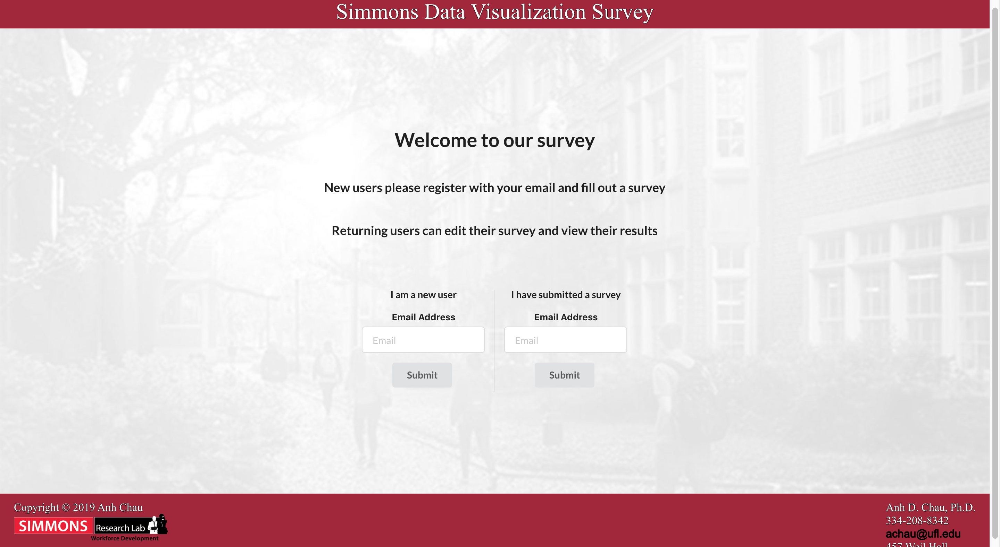
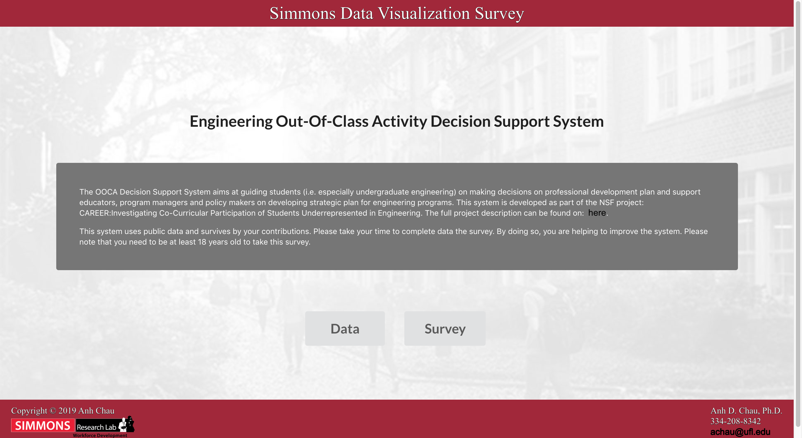
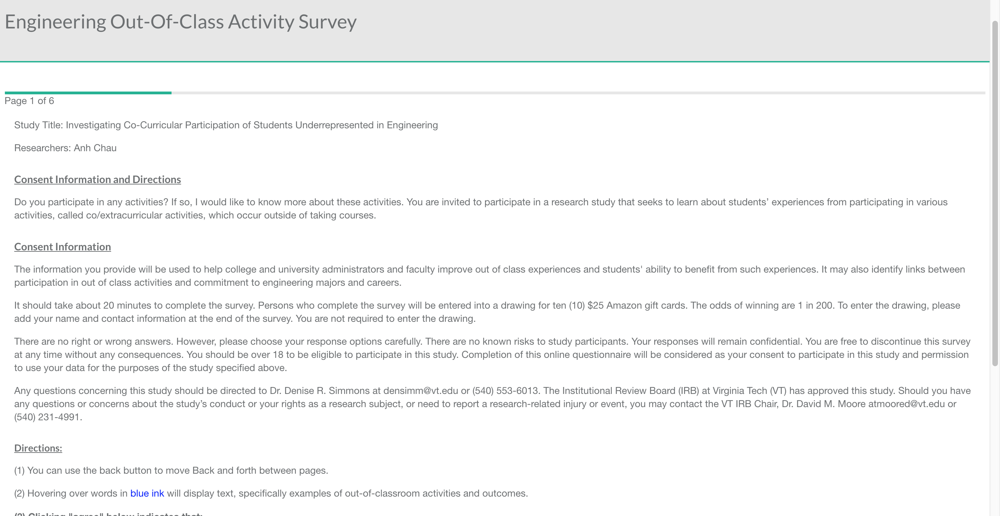
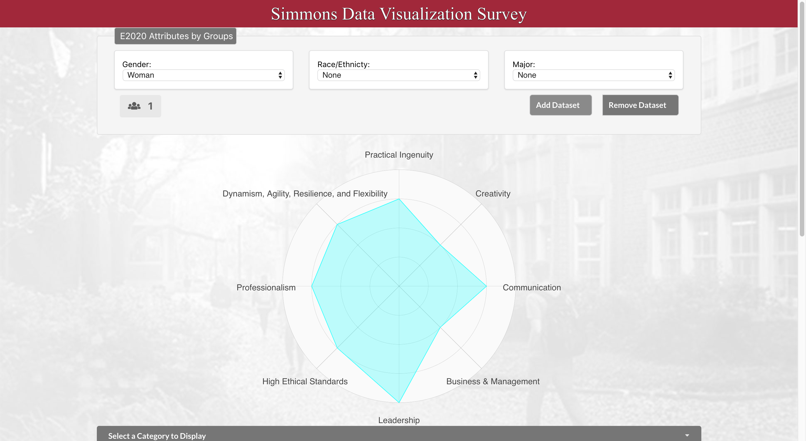
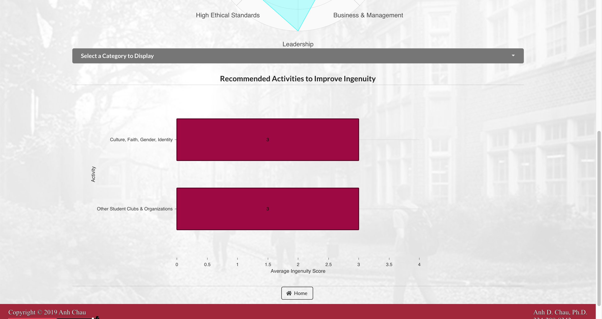

# Simmons Data Visualization

This web application is a survey taking and data visualization website where students complete a survey and can view 

## Link
https://simmons-data-vis.herokuapp.com/

## Credit
This project was bootstrapped with [Create React App](https://github.com/facebook/create-react-app).

## Features Implemented
Register/Login Page


Homepage


Survey Page



Data Page



Admin Page

## Run Project
Go into the develop branch and create two terminals. On one terminal,
```
    cd frontend && yarn start
```
A page should automatically open up with the application. If not, open your browser to localhost:3000.    
  
To start the server, on the other terminal input, 
```
    cd backend && node server.js
```

## Update Database and Server Connections
To update database and server connections, if your project has a backend > config > config.js file locally, then change the following field to your desired database. 
```
    db: { 
        uri: ''
    } 
```
Otherwise you can manually input a database within the backend > config > express.js file on line 11 and change the following code
```
    process.env.MONGODB_URI || require('./config').db.uri
```